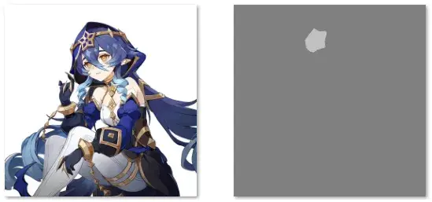

# Training

HCP-Diffusion supports configuring various components used in different training stages through Python configuration files.  
These include model architectures, training parameters and strategies, dataset configurations, and more.

## Basic Training Configuration
Basic training configuration files and examples can be found in the `cfgs/train` directory.  
All training configuration files should inherit both `train_base.py` and `tuning_base.py`.

- `train_base.py`: Defines the hyperparameters and dataset configurations required during training.
- `tuning_base.py`: Defines the model architecture and training parameters used during training, specifying which model parameters and plugins to train, and how to apply LoRA to various layers.

::::{tab-set}
:::{tab-item} Single-GPU Training

```bash
hcp_train_1gpu --cfg cfgs/train/py/config_file.py
```

You can override values in the configuration file via CLI:
```bash
hcp_train_1gpu --cfg cfgs/train/py/config_file.py model.wrapper.models.ckpt_path=pretrained_model_path data_train.dataset1.batch_size=8
```
:::

:::{tab-item} Multi-GPU Training
For multi-GPU training, specify the GPU IDs and number of GPUs in `cfgs/launcher/multi.yaml`, then run:
```bash
hcp_train --cfg cfgs/train/py/config_file.py
```

You can override values in the configuration file via CLI:
```bash
hcp_train --cfg cfgs/train/py/config_file.py model.wrapper.models.ckpt_path=pretrained_model_path data_train.dataset1.batch_size=8
```
:::
::::

## Model Configuration

### Base Model Configuration
The base model is configured in the `model` section. The structure is defined under `model.wrapper`, where you can initialize a model, such as loading a pretrained SD1.5 model:

```python
from hcpdiff.models import SD15Wrapper
from hcpdiff.easy import SD15_auto_loader

wrapper=SD15Wrapper.from_pretrained(  # Model wrapper
    _partial_=True,
    models=SD15_auto_loader(ckpt_path='Lykon/DreamShaper', _partial_=True),  # Simplified pretrained model loader
),
```

```{note}
You can also load the model using lower-level APIs. See [Model Format Documentation](./model_format.md) for details.
```

### Replacing VAE

::::{tab-set}
:::{tab-item} Diffusers-format VAE

You can specify a different VAE module in the wrapper:
```python
from hcpdiff.models import SD15Wrapper
from hcpdiff.easy import SD15_auto_loader
from diffusers import AutoencoderKL

wrapper=SD15Wrapper.from_pretrained(  # Model wrapper
    _partial_=True,
    models=SD15_auto_loader(
        ckpt_path='Lykon/DreamShaper',
        vae=AutoencoderKL.from_pretrained('vae/'),
        _partial_=True
    ),
),
```

:::

:::{tab-item} Single-file Format (WebUI format)

You can also use a single VAE checkpoint file:
```python
from hcpdiff.models import SD15Wrapper
from hcpdiff.easy import SD15_auto_loader
from diffusers import AutoencoderKL

wrapper=SD15Wrapper.from_pretrained(  # Model wrapper
    _partial_=True,
    models=SD15_auto_loader(
        ckpt_path='Lykon/DreamShaper',
        vae=AutoencoderKL.from_single_file('vae.ckpt'),
        _partial_=True
    ),
),
```

:::
::::

## Dataset Configuration
HCP-Diffusion supports multiple parallel datasets. For each training step, one batch is sampled from each dataset independently for forward and backward propagation. Their gradients are then summed.  
Because each dataset is processed independently, image sizes and formats may differ. You can adjust the proportion and weight of each dataset using `batch_size` and `loss_weight`.

Example:
```python
from hcpdiff.data import TextImagePairDataset

data_train=dict(
    dataset1=TextImagePairDataset(_partial_=True, batch_size=4, loss_weight=1.0,
        ...
    ),
    dataset2=TextImagePairDataset(_partial_=True, batch_size=1, loss_weight=1.0,
        ...
    ),
)
```

```{tip}
If the importance of `dataset1` and `dataset2` is in ratio a:b, then they should satisfy:  
$\frac{batch\_size_1 \times loss\_weight_1}{batch\_size_2 \times loss\_weight_2} = \frac{a}{b}$
```

For a detailed explanation, see [RainbowNeko Engine Dataset Configuration](https://rainbownekoengine.readthedocs.io/zh-cn/stable/train/data.html)

### Data Sources

Each dataset can define multiple data sources. All sources within a dataset will be bucketed, shuffled, and processed together—effectively merging them.

Example:
```python
from hcpdiff.data import TextImagePairDataset, Text2ImageSource

dataset1=TextImagePairDataset(_partial_=True, batch_size=4, loss_weight=1.0,
    source=dict(
        data_source1=Text2ImageSource(
            img_root='imgs1/',
            label_file='${.img_root}',  # Label file path (same as image root)
            prompt_template='prompt_template/caption.txt',  # Prompt template
            repeat=1,  # Repeat the dataset N times to adjust its weight
        ),
        data_source2=Text2ImageSource(
            img_root='imgs2/',
            label_file='${.img_root}',
            prompt_template='prompt_template/caption.txt',
        ),
    ),
    ...
)
```

See more at [RainbowNeko Engine Data Source Configuration](https://rainbownekoengine.readthedocs.io/zh-cn/stable/train/data.html#data-source-configuration)

### Buckets
Buckets group images with similar characteristics into the same batch.

Supported bucket types include:

+ **FixedBucket**: Resize and crop all images to a fixed resolution.
```python
from rainbowneko.data import FixedBucket
FixedBucket(
    target_size=[512, 512]  # Use a fixed resolution of 512x512
)
```

+ **RatioBucket (ARB)**: Group images by aspect ratio. Each batch can have a different ratio.
    + From ratios:
    ```python
    from rainbowneko.data import RatioBucket
    RatioBucket.from_ratios(
        target_area=512*512,
        num_bucket=6,

        # Optional:
        step_size=8, # Step size for bucket
        ratio_max=4, # Maximum aspect ratio
        pre_build_bucket='path.pkl',  # Save buckets for reuse
    )
    ```
    + From files:
    ```python
    from rainbowneko.data import RatioBucket
    RatioBucket.from_files(
        target_area=512*512,
        num_bucket=6,

        step_size=8,
        pre_build_bucket='path.pkl',
    )
    ```

+ **SizeBucket**: Group images by resolution. Each batch may have different sizes.
    + From files:
    ```python
    from rainbowneko.data import SizeBucket
    SizeBucket.from_files(
        num_bucket=6,
        step_size=8,
        pre_build_bucket='path.pkl',
    )
    ```

+ **LongEdgeBucket**: Resize images by the long edge, then group by resolution.
    + From files:
    ```python
    from rainbowneko.data import LongEdgeBucket
    LongEdgeBucket.from_files(
        target_edge=800,
        num_bucket=6,
        step_size=8,
        pre_build_bucket='path.pkl',
    )
    ```

### Advanced Dataset Configurations

:::{dropdown} Adding a Regularization Dataset
:animate: fade-in

Use a regularization dataset for DreamBooth, or to help the model retain its original generative ability when learning from self-generated images.

First, prepare a prompt dataset and generate images using the workflow:
```bash
hcp_run --cfg cfgs/workflow/text2img_dataset.py
```

Specify the model and prompt dataset in the configuration file.

```{note}
The prompt dataset format is the same as a regular dataset, just without images.
```
:::

:::{dropdown} Using Prompt Templates
:animate: fade-in

Prompt templates allow placeholders to be replaced by specified text during training.

For example:
```a photo of a {pt1} on the {pt2}, {caption}```

Here, `{pt1}` and `{pt2}` will be replaced by `TemplateFillHandler` with the specified words, which can be either pretrained tokens or custom embeddings.

Example:
```python
from hcpdiff.data.handler import TemplateFillHandler

TemplateFillHandler(
    word_names={
        'pt1': 'my-cat',
        'pt2': 'sofa',
    },
)
```

````{important}
Recommended: Use the simplified Stable Diffusion handler:
```python
from hcpdiff.data import StableDiffusionHandler
handler=StableDiffusionHandler(
    bucket=RatioBucket,
    word_names={
        'pt1': 'my-cat',
        'pt2': 'sofa',
    },
    erase=0,
),
```
````

During training, `{pt1}` will be replaced with the embedding for `my-cat`, `{pt2}` with `sofa`, and `{caption}` with the image caption (if available).

:::

## Fine-tuning Configuration
Fine-tuning can be applied to various components, commonly UNet and text encoder. You can assign different learning rates to different parts.

Example:
```python
from rainbowneko.parser import CfgWDModelParser

model_part=CfgWDModelParser([
        dict(
            lr=1e-5,
            layers=['denoiser'],  # Train U-Net
            # layers=['TE'],      # Or train TextEncoder
        )
    ],
    weight_decay=1e-2  # Default weight decay
),
```

```{note}
The layer names should match the module paths in `model.named_modules()` (PyTorch format). Regex can be used, e.g., `re:denoiser\..*\.attn1$` for all self-attention layers in UNet.

Model configuration follows the RainbowNeko Engine system. See [RainbowNeko Engine Configuration](https://rainbownekoengine.readthedocs.io/zh-cn/stable/train/first.html)
```

:::{dropdown} Training Multiple Parts with Different Learning Rates
:animate: fade-in

Same learning rate for UNet and text encoder:
```python
from rainbowneko.parser import CfgWDModelParser

model_part=CfgWDModelParser([
        dict(
            lr=1e-5,
            layers=[
                'denoiser',
                'TE',
            ],
        ),
    ],
    weight_decay=1e-2
),
```

Different learning rates:
```python
from rainbowneko.parser import CfgWDModelParser

model_part=CfgWDModelParser([
        dict(
            lr=1e-5,
            layers=['denoiser'],
        ),
        dict(
            lr=2e-6,
            layers=['TE'],
        )
    ],
    weight_decay=1e-2
),
```

:::

## Prompt-tuning Configuration
Prompt-tuning trains word embeddings, with each embedding possibly covering multiple token positions.

First, create the custom word:
```bash
python -m hcpdiff.tools.create_embedding pretrained_model_path word_name token_length [--init_text initial_word]
# Random init: --init_text *[std, token_len]
# Partial init: --init_text cat, *[std, token_len], tail
```

Specify the word to train with `emb_pt`:
```python
from hcpdiff.parser import CfgEmbPTParser
emb_pt=CfgEmbPTParser(
    emb_dir='embs/',
    cfg_pt={
        'pt-paimeng': dict(lr=0.003, weight_decay=1e-2)
    }
),
```

## LoRA Training Configuration
LoRA can be applied to any `Linear` or `Conv2d` layer.

The configuration is similar to fine-tuning, but LoRA is added as a plugin:
```python
from rainbowneko.parser import CfgWDPluginParser
from hcpdiff.models.lora_layers_patch import LoraLayer
model_plugin=CfgWDPluginParser(cfg_plugin=dict(
    lora1=LoraLayer.wrap_model(
        _partial_=True,  # Required
        lr=1e-4,  # Learning rate for this plugin
        rank=4,  # LoRA dimension
        alpha=2,  # LoRA weight
        layers=[
            're:denoiser.*\.attn.?$',  # Attention layers
            're:denoiser.*\.ff$',      # FeedForward layers
        ]
    )
), weight_decay=0.1),  # Default weight decay for all plugins
```

## Advanced Configuration

:::{dropdown} Loss Weight Mask (Assigning different importance to image regions)
:animate: fade-in



When training data is limited, the model may struggle to learn important features.  
You can use a loss mask to guide the model to focus more (or less) on specific areas during training.

Loss masks and original images should be placed in separate folders with the same filenames.

The grayscale brightness of the mask determines the attention multiplier:

| Brightness | 0% | 25% | 50% | 75% | 100% |
|------------|----|-----|-----|-----|------|
| Multiplier | 0% | 50% | 100%| 300%| 500% |

:::

### CLIP Skip
Some models skip a few CLIP blocks during training.  
Set the `clip_skip` value in the `TE_hook_cfg` parameter under `model.wrapper`.  
Default is 0 (equivalent to `clip skip=1` in webui), meaning no blocks are skipped.

````{tip}
To skip one block:
```python
TE_hook_cfg=TEHookCFG(clip_skip=1)
```
````

