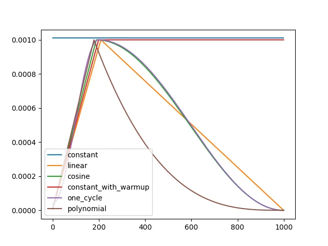

# 配置文件说明

这部分主要介绍```cfgs/train/train_base.py```中的训练参数设置。这里定义了基础的训练参数配置，所有的训练配置文件都应该继承自这个文件。

配置文件的语法为`python`格式，支持`OmegaConf`和`hydra`的拓展语法。

比如引用配置中的其他值:
```python
dict(
    total_steps = 1000,
    train=dict(
        train_steps='${total_steps}', # root路径
        save_step='${.train_steps}' # 同级路径
    ),
    save_step = '${train.train_steps}', # root路径
)
```

```{note}
其他高级操作见 [RainbowNeko Engine配置文件](https://rainbownekoengine.readthedocs.io/en/stable/guide/cfg.html)
```

## 训练整体配置

```python
# 导入必要的python包
import time
from functools import partial

import torch
from torch.nn import MSELoss

from rainbowneko.ckpt_manager import ckpt_saver
from rainbowneko.train.loggers import CLILogger
from rainbowneko.utils import ConstantLR
from rainbowneko.parser import neko_cfg
from hcpdiff.loss import DiffusionLossContainer

# 可以定义全局变量
time_format="%Y-%m-%d-%H-%M-%S"

@neko_cfg # 只有被@neko_cfg装饰的函数，才会被编译成配置
def make_cfg(): # make_cfg是配置文件的入口，解析器会读取这个函数的返回结果作为配置
    return dict(
        exp_dir=f'exps/{time.strftime(time_format)}', # 实验数据保存目录
        mixed_precision=None, # 训练使用的精度，支持fp32,fp16,bf16,fp8。None为fp32。
        allow_tf32=True, # 开启tf32加速训练
        seed=114514, # 训练使用的随机种子，固定种子方便复现

        ckpt_saver=dict( # 模型保存器
            model=ckpt_saver() # 默认保存器保存所有模型和插件
        ),

        train=dict(
            train_steps=1000, # 训练总步数
            train_epochs=None,  # 训练总epochs(轮数)，优先级比train_steps高
            gradient_accumulation_steps=1, # 梯度累积步数
            workers=4, # 读取数据的进程数
            max_grad_norm=1.0, # 梯度裁剪
            set_grads_to_none=False, # 是否将梯度置为None，可以节省显存
            retain_graph=False, # 是否保留计算图
            save_step=100, # 保存模型步数间隔

            resume=None, # 接着之前训练的模型继续训练

            loss=DiffusionLossContainer(MSELoss(reduction='none')), # 损失函数，默认MSE loss
            optimizer=torch.optim.AdamW(_partial_=True, weight_decay=1e-2), # 模型优化器
            scale_lr=False,  # 根据 batch size 自动缩放学习率
            scheduler=ConstantLR( # 学习率曲线
                _partial_=True,
                warmup_steps=500,
            ),

            metrics=None,  # 训练阶段评估指标
        ),

        logger=[
            partial(CLILogger, out_path='train.log', log_step=20), # 日志记录器，输出到控制台
        ],

        model=dict(
            name='model', # 模型名称，保存时使用

            enable_xformers=False, # 是否开启xformers优化
            gradient_checkpointing=True, # 是否开启梯度检查点优化，节省显存
            force_cast_precision=False, # 是否强制转换精度，损失精度节省显存
            ema=None, # 是否使用EMA模型，提高效果

            wrapper=None, # 模型主体
        ),

        evaluator=None, # 训练阶段评估器，可以用于预览图像或评测模型
        data_train=None, # 数据集相关配置
    )

```

```{tip}
配置中添加`_base_=[train_base]`可以继承`train_base`中的配置。只需要在新的配置里写要添加或覆盖的部分即可。配置的覆盖是递归到相同层级节点的，如果要整个替换，需要在节点中添加`_replace_=True`。
```

## 学习率调整方案



上图显示了各种学习率调整策略随步数的变化，推荐使用```one_cycle```或```constant_with_warmup```.
上升部分通过```warmup_steps```设置，总步数通过```training_steps```设置(默认总训练步数)。

:::{dropdown} 支持的学习率曲线
:animate: fade-in

**constant 与 constant_with_warmup** 固定学习率
```python
from rainbowneko.utils.lr_scheduler import ConstantLR

ConstantLR(
    _partial_=True,
    warmup_steps=200, # 预热步数
)
```

**cosine** cosine变化的学习率
```python
from rainbowneko.utils.lr_scheduler import CosineLR

CosineLR(
    _partial_=True,
    warmup_steps=200, # 预热步数
    # num_cycles=0.5, # 使用几个周期，默认0.5如图所示
)
```

**one_cycle** cosine上升和下降的学习率
```python
from rainbowneko.utils.lr_scheduler import OneCycleLR

OneCycleLR(
    _partial_=True,
    warmup_steps=200, # 预热步数
    
    # 可选参数
    # div_factor=, # 最大lr/起始lr
    # final_div_factor=, # 最大lr/结束lr
)
```

**polynomial** 多项式变化的学习率
```python
from rainbowneko.utils.lr_scheduler import PolynomialLR

PolynomialLR(
    _partial_=True,
    warmup_steps=200, # 预热步数
    lr_end=1e-7, # 最终lr
    power=1.0 # 多项式的幂次
)
```

**MultiStepLR** 阶梯式学习率
```python
from rainbowneko.utils.lr_scheduler import MultiStepLR

MultiStepLR(
    _partial_=True,
    step_rules='1:100,0.1:200,0.01:300,0.005' # 100步前学习率1，100-200步学习率0.1，200-300步学习率0.01，300步之后学习率0.005
)
```

**CosineRestartLR** cosine学习率+周期重启
```python
from rainbowneko.utils.lr_scheduler import CosineRestartLR

CosineRestartLR(
    _partial_=True,
    warmup_steps=200, # 预热步数
    num_cycles=5, # 重启次数
)
```

```{note}
optimizer和training_steps两个参数会由框架自动输入。
```

:::

## 模型配置

模型主体在`model.wrapper`中定义。可以定义任意一种模型封装，也可以自定义模型封装。

::::{tab-set}
:::{tab-item} 完整配置

```python
from rainbowneko.ckpt_manager import NekoLoader, LocalCkptSource
from hcpdiff.ckpt_manager import DiffusersSD15Format
from hcpdiff.models import SD15Wrapper

wrapper=SD15Wrapper.from_pretrained( # 这里从预训练的模型初始化
    _partial_=True,
    models=NekoLoader(
        format=DiffusersSD15Format(), # 模型格式
        source=LocalCkptSource(), # 使用本地数据源
    ).load(
        path='Lykon/DreamShaper', # 预训练模型路径
        _partial_=True
    )
),
```

```{note}
关于`models`详细的配置见 [模型文件格式说明](./model_format.md)
```

:::

:::{tab-item} 简化配置

```python
from hcpdiff.easy import SD15_auto_loader
from hcpdiff.models import SD15Wrapper

wrapper=SD15Wrapper.from_pretrained(
    _partial_=True,
    models=SD15_auto_loader(
        ckpt_path='Lykon/DreamShaper', # 预训练模型路径
        _partial_=True
    ),
),
```

```{note}
关于`models`详细的配置见 [模型文件格式说明](./model_format.md)
```

:::
::::


## Loss配置

为loss添加Min-SNR weight:
```python
from torch import nn
from hcpdiff.loss import MinSNRWeight, DiffusionLossContainer

loss=MinSNRWeight(
    DiffusionLossContainer(nn.MSELoss()),
    gamma=5, # Min-SNR的参数
)
```

使用SSIM loss:
```python
from hcpdiff.loss import SSIMLoss, DiffusionLossContainer

loss=DiffusionLossContainer(SSIMLoss())
```